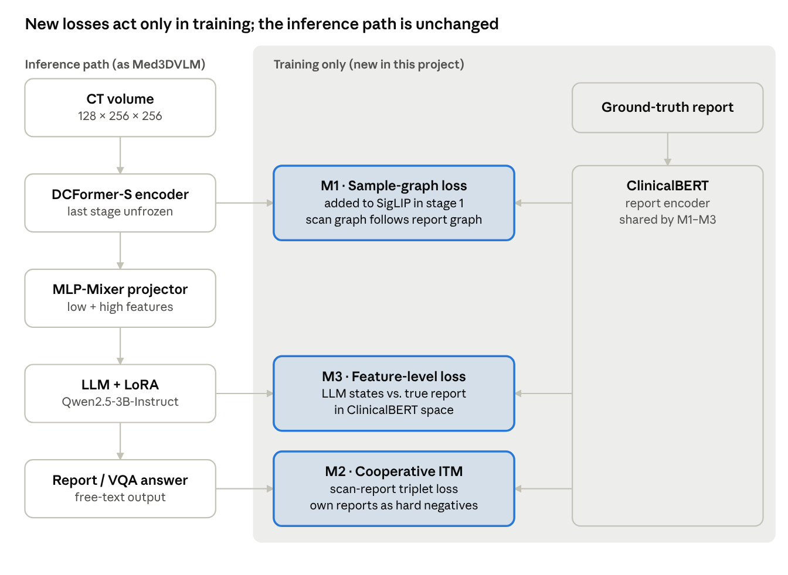
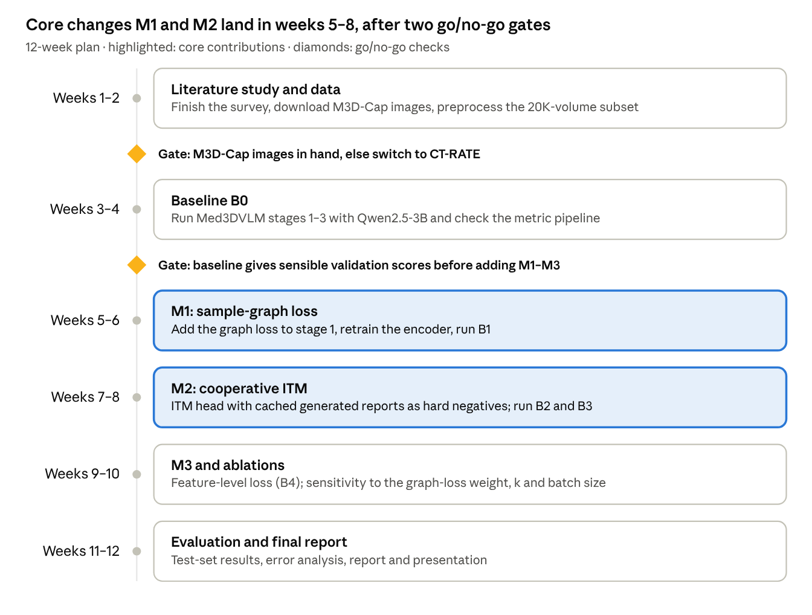

# Project Proposal: Design of a Vision-Language Model for 3D Medical Image Analysis

Draft, 3 October 2026

## Project details

This mini project builds a compact vision-language model (VLM) that reads a 3D CT scan and answers in text: it writes a radiology report and answers questions about the scan.

| Item | Details |
| --- | --- |
| Project title | Design of a Vision-Language Model for 3D Medical Image Analysis |
| Course | Deep Learning — mini project (PhD coursework) |
| Institute | National Institute of Technology Karnataka (NITK), Surathkal |
| Research scholar | Thripthika M P (Lecturer, KPT Mangalore) |
| Base paper 1 | Med3DVLM: An Efficient Vision-Language Model for 3D Medical Image Analysis \[1\] |
| Base paper 2 | Diagnostic Captioning by Cooperative Task Interactions and Sample-Graph Consistency \[2\] |
| Tasks | Radiology report generation, visual question answering (VQA), image-text retrieval |

## Introduction and problem statement

Radiologists read hundreds of slices per CT volume, and report writing is a major bottleneck. A 3D vision-language model can draft the report and answer clinical questions directly from the volume.

Most medical VLMs (PMC-CLIP, LLaVA-Med, R2GenGPT) work on 2D images such as chest X-rays. Moving to 3D CT is hard for three reasons:

1. **Compute cost.** 3D CNNs scale cubically with kernel size and 3D vision transformers scale quadratically with the number of tokens, so high-resolution volumes (128 × 256 × 256) are expensive.
2. **Weak image-text alignment.** CLIP-style contrastive loss needs very large batches of negatives, which 3D medical training cannot afford. Med3DVLM fixes part of this with a sigmoid (SigLIP) loss, but it still treats every non-matching report as equally negative.
3. **Fine-grained differences and hallucination.** Medical scans look alike; the clinically important difference is small. Med3DVLM still hallucinates findings (for example left ureter abnormalities and renal cortical thinning that are not in the ground truth) and mislocalises lesions.

The Diagnostic Captioning paper (2D chest X-rays) attacks exactly the third problem. It trains report generation together with an image-text matching task, uses generated reports as hard negatives, and adds a sample-graph consistency loss so that similar scans with different reports stay apart in feature space.

**Problem statement.** Design a resource-efficient 3D medical VLM that combines Med3DVLM’s efficient 3D encoder and multi-scale projector with the cooperative-task and sample-graph ideas from diagnostic captioning, to produce more clinically faithful reports and VQA answers from CT volumes.

## Objectives

The project has one main goal: make a 3D medical VLM produce reports and answers that are more faithful to the scan, without adding inference cost. It commits to five objectives:

1. **Build the baseline.** Re-implement a scaled-down Med3DVLM (DCFormer encoder, SigLIP alignment, multi-scale MLP-Mixer projector, LLM with LoRA) on the M3D CT dataset.
2. **Add sample-graph consistency to 3D alignment.** Train the 3D image encoder so that the similarity structure of scans in a batch matches the similarity structure of their reports.
3. **Add cooperative image-text matching (ITM).** Train an ITM branch jointly with report generation, and feed the model’s own generated reports back as hard negatives (self-boosting).
4. **Evaluate fairly.** Compare baseline and modified models on image-text retrieval, report generation and open-/closed-ended VQA, with an ablation for each modification.
5. **Measure clinical faithfulness.** Report clinical keyword accuracy and a hallucination rate, not only BLEU/ROUGE/METEOR.

## Literature review

The two base papers solve complementary halves of the problem: Med3DVLM makes 3D VLMs efficient, and Diagnostic Captioning makes generated reports capture fine-grained differences. No published 3D CT model combines both.

### Base paper 1: Med3DVLM (IEEE JBHI, 2026) \[1\]

Med3DVLM is a 3D VLM for CT with three components:

- **DCFormer encoder** \[8\] splits each 3D convolution into three parallel 1D depthwise convolutions (depth, height, width). It processes 128 × 256 × 256 volumes with 18.2 M parameters and 21.59 GFLOPs, against 87.4 M and 253.23 GFLOPs for M3D-LaMed’s 3D ViT.
- **SigLIP alignment** \[9\] replaces CLIP’s softmax loss with a pairwise sigmoid loss, so alignment works with small batches (64).
- **Dual-stream MLP-Mixer projector** \[10\] fuses low-level (256 × 384) and high-level (32 × 768) encoder features into image tokens for the LLM (Qwen2.5-7B-Instruct, fine-tuned with LoRA \[11\]).

Training has three stages: contrastive pretraining, projector pretraining, and VLM fine-tuning. On M3D it beats M3D-LaMed on every task: retrieval R@1 61.00% vs 19.10% (2,000 test samples), report METEOR 36.42% vs 14.38%, open-ended VQA METEOR 36.76% vs 33.58%, closed-ended VQA accuracy 79.75% vs 75.78%.

**Limitations stated by the authors:** hallucinated findings in reports, errors in lesion localisation, CT-only evaluation, and no use of structured clinical knowledge.

### Base paper 2: Diagnostic Captioning (IEEE TPAMI, 2025) \[2\]

This paper targets 2D chest X-ray report generation and adds two training-only strategies:

- **Cooperative ITM + report generation (self-boosting).** A report-generation branch and an image-text matching branch share the image encoder. The ITM branch (Sentence-BERT report encoder, triplet loss) gives the generator text-correlated visual features. After k = 10 epochs, the generator’s own reports become hard negatives for ITM, so ITM must separate near-correct reports from the true one. A feature-level loss also keeps generated reports close to ground truth in the report-encoder space.
- **Sample-graph consistency loss (SGCL).** In each batch it builds a similarity graph of images and a graph of their ground-truth reports, and trains the image graph to match the report graph. Two similar scans with different reports are pushed apart.

On MIMIC-CXR (222,758 training samples) the ablation shows each part helps: CIDEr rises from 0.169 (generation only) to 0.193 (+ITM), 0.231 (+self-boosted triplet loss) and 0.245 (+SGCL). The full model reaches BLEU-4 0.129, METEOR 0.164, CIDEr 0.342 and the best RadCliQ (1.178). Only the generation branch runs at inference, so inference cost does not change.

### Related work

| Method | Venue | Input | Key idea | Gap for this project |
| --- | --- | --- | --- | --- |
| CLIP \[3\] | ICML 2021 | 2D natural images | Softmax contrastive image-text pretraining | Needs very large batches |
| LLaVA \[4\] | NeurIPS 2023 | 2D | Visual instruction tuning: vision encoder + LLM | 2D only |
| R2Gen \[5\] | EMNLP 2020 | 2D chest X-ray | Memory-driven transformer for report generation | 2D, no LLM |
| LLaVA-Med \[6\] | NeurIPS 2023 | 2D biomedical | LLaVA adapted to biomedicine | 2D only |
| RadFM \[7\] | Nat. Commun. 2025 | 2D + 3D | Generalist radiology foundation model | Built mainly for text generation; weaker image-text understanding |
| M3D-LaMed \[12\] | arXiv 2024 | 3D CT | 3D ViT + CLIP + spatial pooling perceiver; M3D dataset | Heavy 3D encoder; CLIP needs large batches |
| CT2Rep \[13\] | MICCAI 2024 | 3D chest CT | 3D vision encoder for chest CT reports | Chest only, no VQA |
| Med3DVLM \[1\] | JBHI 2026 | 3D CT | DCFormer + SigLIP + MLP-Mixer projector | Hallucination, coarse negatives |
| Diagnostic Captioning \[2\] | TPAMI 2025 | 2D chest X-ray | ITM self-boosting + sample-graph consistency | Not tested on 3D or with LLMs |

## Dataset

The primary dataset is M3D (M3D-Cap + M3D-VQA), the same data as Med3DVLM, so results compare directly with the base paper. CT-RATE is the backup and a second, external test set.

| Dataset | Content | No. of samples | No. of classes / categories | Split | Access |
| --- | --- | --- | --- | --- | --- |
| [M3D-Cap](https://github.com/BAAI-DCAI/M3D) \[12\] | 3D CT volumes + radiology captions (Radiopaedia), many body regions | 120,092 image-text pairs (42,496 unique texts) | No class labels: free-text report generation and retrieval | Med3DVLM split: 115K train / 3K val / 2K test (test subsets of 100, 500, 1K, 2K) | \~978 GB; the [Hugging Face copy](https://huggingface.co/datasets/GoodBaiBai88/M3D-Cap) is disabled by a DMCA notice; ModelScope mirror listed by the authors |
| [M3D-VQA](https://huggingface.co/datasets/GoodBaiBai88/M3D-VQA) \[12\] | Question-answer pairs on M3D CT volumes | 96,170 volumes, 509,755 QA pairs | 5 question categories: Plane, Phase, Organ, Abnormality, Location; each open-ended and closed-ended (4 options, A–D) | Official train / val / test CSVs, plus a 5K test subset | Open on Hugging Face; images come from M3D-Cap |
| [CT-RATE](https://huggingface.co/datasets/ibrahimhamamci/CT-RATE) \[14\] | Non-contrast chest CT + radiology reports | 25,692 volumes from 21,304 patients (50,188 reconstructions) | 18 abnormality labels (multi-label) | 20,000 train / 1,304 validation patients | Gated, CC BY-NC-SA 4.0, 21.3 TB in total |

**Working subset for the mini project.** Training on all 120K volumes needs 8 × A100 GPUs in the base paper. This project will use about 20,000 M3D-Cap training volumes with their VQA pairs, 1,000 for validation, and the official 2,000-sample test split, so test numbers stay comparable with Med3DVLM.

**Preprocessing.** Each volume is resampled to 128 × 256 × 256 and intensity-normalised to \[0, 1\], using the Med3DVLM data-preparation script. Reports are lower-cased and truncated to the LLM context limit.

**Open question.** If the M3D-Cap images cannot be downloaded from ModelScope or the authors, the project switches to CT-RATE (chest CT only); its 18 abnormality labels also allow a classification check of the learned encoder.

## Methodology (baseline)

The baseline follows Med3DVLM’s three-stage pipeline \[1\], scaled down to fit a single GPU. The public Med3DVLM code and the released DCFormer-SigLIP checkpoint are the starting point.

### Model components

- **3D image encoder: DCFormer-small** \[8\]. A stem plus four stages with \[2, 3, 6, 2\] layers and \[96, 192, 384, 768\] channels. Each block replaces a 3D convolution with three 1D depthwise convolutions (kernel k ∈ {13, 11, 9, 7}):

```latex
X' = X + \mathrm{Norm}_h\big(\mathrm{DWConv}^{k\times1\times1}(X)\big) + \mathrm{Norm}_w\big(\mathrm{DWConv}^{1\times k\times1}(X)\big) + \mathrm{Norm}_d\big(\mathrm{DWConv}^{1\times1\times k}(X)\big)
```

- **Text encoder: ClinicalBERT**, using the \[CLS\] token as the report embedding. Image and text embeddings are projected to a shared 768-d space.
- **Multi-modal projector: dual-stream MLP-Mixer.** One Mixer stream takes low-level features (256 × 384, penultimate stage) and one takes high-level features (32 × 768, final stage). Their outputs are concatenated into image tokens.
- **LLM with LoRA.** The base paper uses Qwen2.5-7B-Instruct. This project uses Qwen2.5-3B-Instruct with the same LoRA settings to fit a single GPU.

### Training stages

1. **Contrastive pretraining** on M3D-Cap image-report pairs. The encoder and ClinicalBERT are trained with the SigLIP loss, where z\_ij = 1 for matching pairs and −1 otherwise, t is a temperature and b a bias:

```latex
\mathcal{L}_{\mathrm{SigLIP}} = -\frac{1}{|B|}\sum_{i=1}^{|B|}\sum_{j=1}^{|B|}\log\frac{1}{1+e^{\,z_{ij}(-t\,\mathbf{x}_i\cdot\mathbf{y}_j+b)}}
```

2. **Projector pretraining** on image-question-answer triplets (yes/no questions excluded). Only the MLP-Mixer projector is trained; the encoder and LLM are frozen.
3. **VLM fine-tuning** for report generation and VQA. The projector and LoRA adapters (rank 16, α = 32, dropout 0.05) are trained with next-token cross-entropy; everything else stays frozen.

### Planned settings

| Stage | Trained parts | Base paper setting | This project (planned) |
| --- | --- | --- | --- |
| 1. Contrastive | DCFormer, ClinicalBERT | Batch 64, lr 1e-4, weight decay 0.1, 100 epochs | Start from released checkpoint; batch 32 with gradient accumulation, \~20 epochs |
| 2. Projector | MLP-Mixer projector | Batch 16, lr 1e-4, 3 epochs | Batch 8, lr 1e-4, 3 epochs |
| 3. Fine-tuning | Projector + LoRA | Batch 8, lr 5e-5, 5 epochs | Batch 4 with accumulation, lr 5e-5, 3–5 epochs |

All stages use PyTorch, Hugging Face Transformers, AdamW with a cosine schedule, and BF16 precision. The base paper trained on 8 × A100 (80 GB).

## Proposed modifications to the methodology

The project adds three training-only changes from Diagnostic Captioning \[2\] to the Med3DVLM pipeline. At inference only the image → projector → LLM path runs, so model size and inference cost stay the same as the baseline.



The left column is the inference path, the same as Med3DVLM. The shaded area holds the three training-only additions, which all reuse the ClinicalBERT report encoder.

| Component | Med3DVLM (baseline) | Proposed | Reason |
| --- | --- | --- | --- |
| Stage-1 alignment loss | SigLIP only | SigLIP + sample-graph consistency loss (M1) | Not all non-matching reports are equally wrong; similar reports should give similar scan embeddings |
| Fine-tuning objective | Next-token cross-entropy only | Cross-entropy + ITM triplet loss (M2) + feature-level loss (M3) | Adds sentence-level, clinically meaningful supervision |
| Negatives for matching | Other reports in the batch | Also the model’s own generated reports, after k epochs | Generated reports are near-misses: the hardest negatives |
| Image encoder in fine-tuning | Frozen | Last DCFormer stage unfrozen and shared by the LLM path and the ITM head | Lets matching gradients sharpen fine-grained visual features |
| ClinicalBERT | Used only in stage 1 | Reused as the report encoder for M1–M3 | No extra model or labels needed |

### M1 — Sample-graph consistency in 3D contrastive pretraining

For a batch of B scan-report pairs, I\_i is the pooled DCFormer embedding and T\_i the ClinicalBERT embedding. Two similarity graphs are built, W\_I from the scans and W\_T from the reports (σ is a temperature), and each row is normalised to sum to 1 (Ŵ):

```latex
W_T^{ij} = \exp\!\left(\frac{T_i \cdot T_j}{\sigma}\right), \qquad W_I^{ij} = \exp\!\left(\frac{I_i \cdot I_j}{\sigma}\right), \qquad \mathcal{L}_{\mathrm{graph}} = -\sum_{i=1}^{B}\sum_{j=1}^{B} \hat{W}_T^{ij}\,\log \hat{W}_I^{ij}
```

The report graph is the target (no gradient flows into it), so the scan graph learns the structure of the reports. The stage-1 loss becomes L1 = L\_SigLIP + λ\_g · L\_graph. The extra cost is one B × B matrix per batch, so it suits SigLIP’s small batches.

### M2 — Cooperative image-text matching with self-boosted hard negatives

An ITM head scores each scan-report pair with the cosine similarity S(I, T) of their embeddings. It is trained with a triplet loss on the hardest in-batch negatives (T̄, Ĩ), with margin α = 0.2 as in \[2\]:

```latex
\mathcal{L}_{\mathrm{match}} = \big[\alpha - S(I,T) + S(I,\bar{T})\big]_+ + \big[\alpha - S(I,T) + S(\bar{I},T)\big]_+
```

After k epochs the generated report T^g joins as a hard negative. The true report must score higher than the generated one, and the generated one higher than other patients’ reports:

```latex
\mathcal{L}_{\mathrm{match\text{-}gen}} = \big[\alpha - S(I,T) + S(I,T^{g})\big]_+ + \big[\alpha - S(I,T^{g}) + S(I,\bar{T})\big]_+
```

**3D adaptation.** Generating LLM reports at every step is too slow, so reports for the training subset are generated once per round and cached. ITM and LLM updates alternate between rounds, as the alternating schedule (m = 5 epochs) in \[2\].

### M3 — Feature-level (semantic) loss

Cross-entropy only checks word-by-word overlap. M3 also asks the predicted report to match the true report in meaning. Because LLM output is discrete, the LLM’s last-layer hidden states over the report tokens are mean-pooled, mapped by a small linear head g into ClinicalBERT space, and compared with the true report’s embedding:

```latex
\mathcal{L}_{\mathrm{feat}} = \big\lVert\, g(\bar{h}_{\mathrm{LLM}}) - \Phi_{\mathrm{ClinicalBERT}}(T) \,\big\rVert_2
```

### Total fine-tuning loss

```latex
\mathcal{L}_{\mathrm{FT}} = \lambda_{CE}\,\mathcal{L}_{CE} + \lambda_{ITM}\,\mathcal{L}_{ITM} + \lambda_{feat}\,\mathcal{L}_{feat}, \qquad \mathcal{L}_{ITM} = \begin{cases} \mathcal{L}_{\mathrm{match}}, & \text{epoch} \le k \\ \mathcal{L}_{\mathrm{match\text{-}gen}}, & \text{epoch} > k \end{cases}
```

The weights λ and the switch epoch k are tuned on the validation set, starting from the values in \[2\]. M1 and M2 are the core contributions; M3 is a stretch goal if time allows.

## Evaluation plan

All models are tested on the same official 2,000-sample M3D test split. The project succeeds if the modified model beats the reproduced baseline on METEOR and clinical keyword accuracy, without losing retrieval or VQA accuracy.

| Task | Metrics | Follows |
| --- | --- | --- |
| Image-text retrieval | Recall@1, @5, @10 for image→text and text→image, at 100, 500, 1,000 and 2,000 test samples | \[1\] |
| Report generation | BLEU, ROUGE, METEOR, BERTScore | \[1\] |
| Clinical faithfulness | Keyword accuracy: share of ground-truth clinical keywords (organs, findings) present in the generated report. Hallucination rate: share of generated findings absent from the ground truth | \[2\] |
| Open-ended VQA | BLEU, ROUGE, METEOR, BERTScore for each of the 5 question categories | \[1\] |
| Closed-ended VQA | Accuracy for each of the 5 question categories | \[1\] |
| Encoder check (if CT-RATE is used) | AUROC of a linear probe on the 18 abnormality labels | \[2\] |

### Ablation study

| Model | M1 sample-graph | M2 cooperative ITM | M3 feature loss | Question it answers |
| --- | --- | --- | --- | --- |
| B0 Baseline (reproduced) | — | — | — | Reference at the same data and LLM scale |
| B1 | ✓ | — | — | Does graph consistency improve alignment and retrieval? |
| B2 | — | ✓ | — | Do self-boosted hard negatives improve reports? |
| B3 (proposed core) | ✓ | ✓ | — | Do M1 and M2 add up? |
| B4 (full, stretch) | ✓ | ✓ | ✓ | Does semantic supervision help further? |

Sensitivity checks cover the graph-loss weight λ\_g, the switch epoch k and the batch size. The published Med3DVLM and M3D-LaMed results (Literature review) serve as an upper reference, since they use the full dataset and a 7B LLM.

## Expected outcomes, resources and timeline

The project delivers a working single-GPU 3D medical VLM and a measured answer to one question: do cooperative matching and sample-graph consistency make 3D CT reports more faithful?

### Expected outcomes

- Reproducible code and checkpoints for the baseline (B0) and the modified models (B1–B4).
- Higher retrieval recall from M1, because scan embeddings follow report structure.
- Higher METEOR and keyword accuracy and fewer hallucinated findings from M2 and M3.
- No change in inference cost, since all new parts are used only in training.
- A final report with the ablation, error analysis and example outputs.

### Resources

| Item | Plan |
| --- | --- |
| GPU | One GPU with 40–48 GB memory (NITK HPC). Fallback on 24 GB: Qwen2.5-1.5B and a smaller subset |
| Storage | About 300 GB (estimate) for the 20K-volume subset and preprocessed volumes |
| Software | PyTorch, Hugging Face Transformers and PEFT (LoRA), DeepSpeed, MONAI for 3D preprocessing, pycocoevalcap and bert-score for metrics |
| Code and weights | [Med3DVLM repository](https://github.com/mirthAI/Med3DVLM) with released DCFormer-SigLIP and Med3DVLM-Qwen-2.5-7B checkpoints |

### Timeline

The plan assumes a 12-week course project.



The two gates protect the core work: data access is settled by week 2 and a working baseline by week 4, before M1 and M2 are built.

## References

1. Y. Xin, G. C. Ates, K. Gong and W. Shao, “Med3DVLM: An efficient vision-language model for 3D medical image analysis,” *IEEE J. Biomed. Health Inform.*, vol. 30, no. 3, pp. 2524–2536, Mar. 2026. [doi:10.1109/JBHI.2025.3604595](https://doi.org/10.1109/JBHI.2025.3604595)
2. Z. Wang, L. Wang, X. Li and L. Zhou, “Diagnostic captioning by cooperative task interactions and sample-graph consistency,” *IEEE Trans. Pattern Anal. Mach. Intell.*, vol. 47, no. 8, pp. 6585–6598, Aug. 2025. [doi:10.1109/TPAMI.2025.3562866](https://doi.org/10.1109/TPAMI.2025.3562866)
3. A. Radford et al., “Learning transferable visual models from natural language supervision,” in *Proc. ICML*, 2021, pp. 8748–8763.
4. H. Liu, C. Li, Q. Wu and Y. J. Lee, “Visual instruction tuning,” in *Proc. NeurIPS*, 2023, pp. 34892–34916.
5. Z. Chen, Y. Song, T.-H. Chang and X. Wan, “Generating radiology reports via memory-driven transformer,” in *Proc. EMNLP*, 2020, pp. 1439–1449.
6. C. Li et al., “LLaVA-Med: Training a large language-and-vision assistant for biomedicine in one day,” in *Proc. NeurIPS*, 2023, pp. 28541–28564.
7. C. Wu, X. Zhang, Y. Zhang, H. Hui, Y. Wang and W. Xie, “Towards generalist foundation model for radiology by leveraging web-scale 2D&3D medical data,” *Nat. Commun.*, vol. 16, Art. no. 7866, 2025.
8. G. C. Ates, K. Gong and W. Shao, “DCFormer: Efficient 3D vision-language modeling with decomposed convolutions,” [arXiv:2502.05091](https://arxiv.org/abs/2502.05091), 2025.
9. X. Zhai, B. Mustafa, A. Kolesnikov and L. Beyer, “Sigmoid loss for language image pre-training,” in *Proc. ICCV*, 2023, pp. 11975–11986.
10. I. O. Tolstikhin et al., “MLP-Mixer: An all-MLP architecture for vision,” in *Proc. NeurIPS*, 2021, pp. 24261–24272.
11. E. J. Hu et al., “LoRA: Low-rank adaptation of large language models,” in *Proc. ICLR*, 2022.
12. F. Bai, Y. Du, T. Huang, M. Q.-H. Meng and B. Zhao, “M3D: Advancing 3D medical image analysis with multi-modal large language models,” [arXiv:2404.00578](https://arxiv.org/abs/2404.00578), 2024.
13. I. E. Hamamci, S. Er and B. Menze, “CT2Rep: Automated radiology report generation for 3D medical imaging,” in *Proc. MICCAI*, 2024, pp. 476–486.
14. I. E. Hamamci et al., “Developing generalist foundation models from a multimodal dataset for 3D computed tomography,” [arXiv:2403.17834](https://arxiv.org/abs/2403.17834), 2024.

**Dataset and code sources (checked 3 Oct 2026):** [M3D repository](https://github.com/BAAI-DCAI/M3D) · [M3D-Cap on Hugging Face](https://huggingface.co/datasets/GoodBaiBai88/M3D-Cap) · [M3D-VQA on Hugging Face](https://huggingface.co/datasets/GoodBaiBai88/M3D-VQA) · [CT-RATE on Hugging Face](https://huggingface.co/datasets/ibrahimhamamci/CT-RATE) · [Med3DVLM repository](https://github.com/mirthAI/Med3DVLM)
